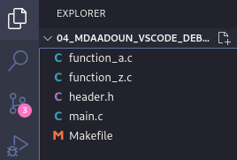

# Debugger avec Visual Studio Code

Visual Studio Code permet une utilisation frontend du debugger gdb avec des fonctionalités simplifiées qui permettent de faire gagner en productivité.

Toutefois le configurer pour la première fois peut parfois un peu décourager, surtout si l'on a pas l'habitude des fichiers de configuration json.

Voici les étapes pas à pas pour configurer facilement VSCode pour compiler et debugger un programme.

## Fichiers exemples

Voici les fichiers que nous allons utiliser en exemple:



Ne pas oublier de **compiler avec le flag -g dans une règle du Makefile.** (Penser a compiler toutes le sources avec ce flag, une librairie .a non recompilé ne sera pas repéré dans gdb)

### main.c
```c
#ifndef HEADER_H
# define HEADER_H

# include <unistd.h>

void print_a(char c);
void print_z(char c);

#endif
```

### function_a.c
```c
#include "header.h"

void print_a(char c)
{
	c = 'a';
	write(1,&c,1);
}

```
### function_z.c
```c
#include "header.h"

void print_z(char c)
{
	c = 'z';
	write(1,&c,1);
}
```
### header.h
```c
#ifndef HEADER_H
# define HEADER_H

# include <unistd.h>

void print_a(char c);
void print_z(char c);

#endif
```

### Makefile
Règle minimale pour compiler le programme.
```makefile
debug:
	gcc -g main.c function_a.c function_z.c
```


## Configuration VSCODE

Maintenant que nous avons un programme qui compile avec une règle Makefile appelée debug, nous avons besoin de nous assurer que VSCode a bien **l'extension C/C++ de Microsoft et l'installer si ce n'est pas le cas.**


Nous avons ensuite besoin de deux fichiers (launch.json et tasks.json) dans un dossier caché (.vscode) à la racine de notre projet.

